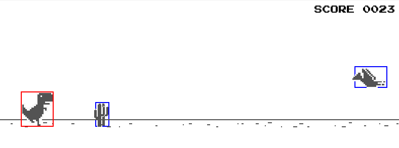
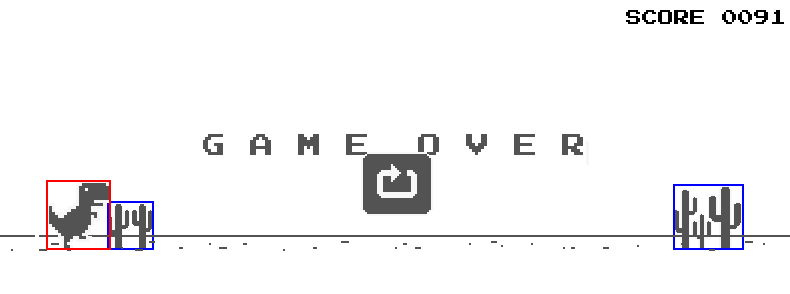
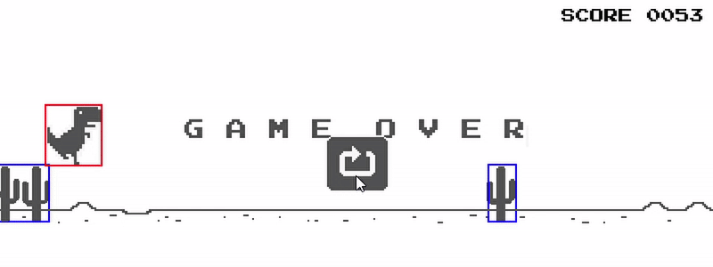

# 🦖 Dino Game (Python + Pygame)

This is a clone of the classic Chrome Dino game built using Python and Pygame. Run, jump, and duck to avoid incoming obstacles like cacti and birds in this endless runner game.




## 🎮 Gameplay Video

▶

## ✨ Features

- Smooth character animation and obstacle movement
- Increasing difficulty as your score goes up
- Jump (`↑` or `SPACE`) and Duck (`↓`) controls
- Multiple types of obstacles: small & large cacti, flying birds
- Game Over and Restart functionality
- Real-time score display

## 📦 Folder Structure

├── assets/
│ ├── Bird/
│ ├── Cactus/
│ ├── Dino/
│ └── Other/
├── game.py
└── README.md

## 🖥️ Requirements

- Python 3.9+
- Pygame

Install dependencies using pip:

```bash
pip install pygame
python game.py

